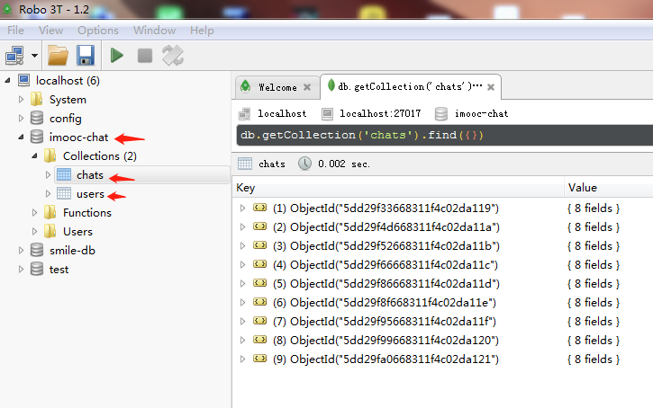

### 一个实时聊天的小demo

## 项目技术栈

客户端：`react + react-redux + react-router + socket.io-client`

服务端：`mongoose + express + socket.io`


## 项目运行

1. clone 项目到本地

2. 切换到项目根目录，下载依赖 (server文件夹下的package.json不用管)
```shell
npm install 
// 或 cnpm install 
```

3. 启动 server，打开一个 cmd 窗口，执行命令
```shell
nodemon server/server.js
```
如果提示没有nodemon，则先全局安装一下
```
npm install -g nodemon
// 或 cnpm install -g nodemon
```

**提示：**

因为 server 端用到了 mongodb，所以启动 server 前得保证你电脑安装了 mongodb，并且你的 mongodb 可以成功连接。
在 server/model.js 里有如下一行代码：
```
const DB_URL = 'mongodb://localhost:27017/imooc-chat'
```
表示的是连接 mongodb 数据库的信息，其中 localhost:27017 是数据库地址，imooc-chat 是数据库名。同时记得在 imooc-chat 里创建两个 collection(数据表的意思)，分别叫 chats 和 users。

如果你不会 mongodb，可以先简单了解一下它，或者参考一下我的这两篇博客
[http://liguixing.com/archives/1174](http://liguixing.com/archives/1174) 和 
[http://liguixing.com/archives/1180](http://liguixing.com/archives/1180)。

同时也推荐一个管理 mongodb 的可视化工具 Robo 3T，界面长这样：




4. 重新打开一个 cmd 窗口，执行命令
```
npm run start
```

**注意：** 两个 cmd 窗口都记得先把路径切换到项目根目录再执行命令


## 问题交流

微信交流群，扫码回复加群

